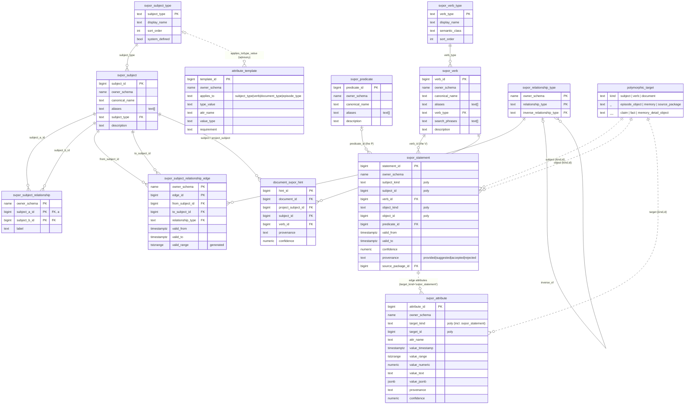
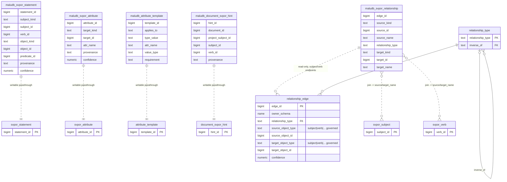

# SVPOR — Entity-Relationship Diagrams

> Source of truth: `sql/extension/maludb_core--0.83.0.sql` (full install script).
> The `malu$` prefix is dropped from entity names for readability; all storage
> tables live in `maludb_core`. Facade views/functions are created per-tenant
> inside each memory-enabled user schema by `enable_memory_schema(...)`.

**Line legend (both diagrams)**

- **Solid line** = DB-enforced FOREIGN KEY.
- **Dashed line** = soft reference with NO DB-level FK — either a polymorphic
  `(kind, id)` pointer (validated only in the write facades) or a view→table proxy.

---

## 1. Storage model (`malu$svpor_*` and supporting tables)

### Notes (storage)

- **V is always a hard FK** (`verb_id → svpor_verb`); **S and O are polymorphic**;
  **P is an optional FK** (`predicate_id → svpor_predicate`). That asymmetry is the
  core of the `svpor_statement` bridge.
- `polymorphic_target` is **not a table** — it abstracts the allowed `*_kind`
  vocabulary: `subject, verb, document, episode_object, memory, source_package,
  claim, fact, memory_detail_object`. Because `subject`/`verb` are valid kinds, a
  statement can point back at the vocab tables.
- `svpor_attribute.target_kind` also accepts `'svpor_statement'`, so attributes
  attach to **edges** as well as nodes.
- `subject_type`/`verb_type` are FK-enforced against the pickers (defaults
  `'concept'`/`'other'`); `attribute_template` matches them by **advisory text**
  (`type_value`), not FK.
- `svpor_subject_relationship` is the *undirected* pair (with a
  `subject_a_id < subject_b_id` constraint); `svpor_subject_relationship_edge` is
  the *directed, typed, valid-time* subject↔subject edge.

---

## 2. Facade layer (`maludb_*` views) → storage

Per-tenant `security_invoker` views, scoped `WHERE owner_schema = current_schema()`.
Four are **writable** 1:1 passthroughs (`WITH LOCAL CHECK OPTION`, paired with
`*_create` / `*_delete` functions); `maludb_svpor_relationship` is **read-only**
and is a *slice of the unified graph*, not of `svpor_subject_relationship_edge`.

### Notes (facades)

- **`maludb_svpor_statement`** → `malu$svpor_statement`. Writers:
  `maludb_svpor_statement_create / _close / _delete / _set_provenance`.
- **`maludb_svpor_attribute`** → `malu$svpor_attribute`. Writers:
  `maludb_svpor_attribute_create / _delete` (create is an upsert on
  `(target_kind, target_id, attr_name)`).
- **`maludb_attribute_template`** → `malu$attribute_template` (advisory catalog).
- **`maludb_document_svpor_hint`** → `malu$document_svpor_hint` (LLM-staged
  `provided|suggested|accepted|rejected` frames awaiting promotion to statements).
- **`maludb_svpor_relationship`** → a **read-only** view over the *unified*
  `malu$relationship_edge` graph, filtered to `source/target_object_type IN
  ('subject','verb')` and LEFT-JOINed to `svpor_subject` / `svpor_verb` to resolve
  `source_name` / `target_name`. Writes go through the
  `maludb_svpor_relationship_create` **function** (which inserts into
  `relationship_edge`), not through the view. Note its `relationship_type` FK is the
  **global** `malu$relationship_type` vocab — distinct from the per-schema
  `malu$svpor_relationship_type` used by `svpor_subject_relationship_edge` in
  diagram 1.
