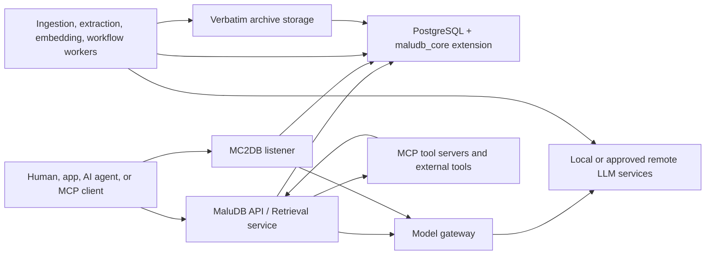
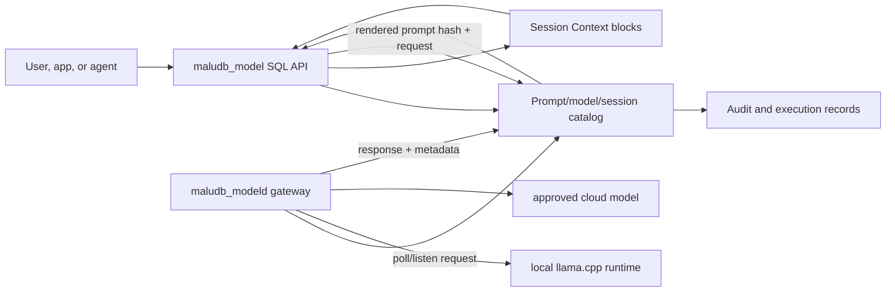

# MaluDB Design Notes

This is a living architectural design notebook for MaluDB. It translates the conceptual model in `white-paper.md` and the implementation contract in `requirements.md` into concrete design decisions for the DBMS, PostgreSQL extension layout, external services, local model integration, and MCP-compatible tool calling. The narrower first release is defined in `release-1.0-requirements.md` and `release-1.0-build-plan.md`.

The white paper remains the conceptual reference. `requirements.md` remains the authoritative implementation requirement. This document is where design tradeoffs, physical boundaries, and evolving implementation choices are recorded before they become code.

## 1. Design Goals

MaluDB is a PostgreSQL-based memory DBMS, not a vector store with metadata and not an application-side RAG bundle. The Enterprise Memory Core must preserve evidence, claims, facts, memories, Episode Objects, recursive details, relationships, workflows, skills, temporal history, confidence, precision, authorization, and derivation lineage inside a coherent DBMS boundary.

The first physical implementation uses upstream PostgreSQL from PGDG as the authoritative transaction, storage, and query boundary. PostgreSQL owns durable state and transactional consistency. External MaluDB services perform model execution, source ingestion, real-time coordination, archive placement, MCP integration, and effectful tool execution, but they do not become independent systems of record.

The architecture is intentionally staged:

- Stage 1 establishes PostgreSQL, pgvector, the PGXS extension skeleton, packaging, CI, and catalog scaffolding.
- Stage 1.5 adds the model runtime extension surface, prompt-template catalog, Session Context, local/cloud model provider adapters, and a governed local runtime package such as `llama.cpp`.
- Stage 1.6 adds the MC2DB network listener extension surface so models can access governed database capabilities through MCP-compatible input.
- Stage 2 introduces source packages, claims, facts, Episode Objects, memories, detail objects, relationship edges, verbatim storage, and the first derivation ledger.
- Stage 3 adds bitemporal behavior, SVPOR routing, MAUT scoring, lifecycle, salience, and supersession.
- Stage 4 adds retrieval planning, FTS, graph traversal, query hints, and authorization-aware hybrid recall.
- Stage 5+ adds workflow extraction, skills, active pools, local nodes, advanced model orchestration, advanced MC2DB memory tools, external MCP brokering, and drivers.

The design rule is simple: if durable memory truth, authorization, identity, provenance, temporal validity, or query visibility depends on it, PostgreSQL must own the authoritative record. If the operation calls models, external tools, connectors, network services, long-running agents, or local device resources, it belongs in a governed service that writes back through audited PostgreSQL transactions.

## 2. Boundary Map



PostgreSQL is the only durable authority. Services may cache, queue, compute, and coordinate, but each durable outcome must land as a PostgreSQL transaction with audit and derivation coverage. This includes source ingestion, extracted claims, accepted facts, memory derivations, embeddings, summaries, workflow candidates, active-pool writes, skill execution records, local-node sync records, and MCP tool outputs that become evidence.

## 3. What Belongs Inside PostgreSQL

The following elements belong inside PostgreSQL because they require ACID behavior, query visibility, authorization, bitemporal history, or stable catalog semantics.

| Area | PostgreSQL-owned design |
|---|---|
| System catalog | Accounts, roles, privileges, schemas, partitions, object types, subject/verb/predicate/relationship types, source types, retention policies, model registry metadata, index definitions, local-node registry, active-pool registry, rebuild state, operational stats. |
| Governed objects | Source packages, claims, facts, Episode Objects, memories, Memory Detail Objects, workflow traces, generalized workflows, procedural memory objects, skill packages, competency packages, relationship edges. |
| Provenance | Derivation Ledger rows, input hashes, output object IDs, parser/model/prompt/policy/verifier metadata, replay eligibility, model-generated artifact links. |
| Temporal truth | `event_time`, valid time, transaction time, source time, verification time, stale-after state, supersession edges, contradiction state, current-valid query modes. |
| Retrieval control | Relational filters, FTS indexes, temporal indexes, graph edge tables, pgvector indexes, candidate visibility filters, result assembly views/functions. |
| Authorization | Table grants, memory-specific grants, row-level policies, semantic-slice grants, active-pool membership, evidence inspection privileges. |
| Model lifecycle metadata | Model identities, versions, dimensions, embedding spaces, rollout state, evaluation status, artifact maps, blue-green migration state. |
| Queues and rebuild state | Durable work queues for embedding, re-derivation, index rebuilds, source reprocessing, active-pool invalidation, skill staleness review. |

PostgreSQL should expose stable SQL functions, views, and extension-owned schemas rather than requiring callers to mutate private base tables directly. Private tables can use implementation-friendly names; public SQL surfaces should be stable, documented, and regression-tested.

## 4. What Stays Outside PostgreSQL

The following elements belong outside PostgreSQL backend processes, even when PostgreSQL stores their state:

| Area | Service-owned design |
|---|---|
| Model inference | Local and approved cloud model calls for extraction, summarization, reranking, workflow mining, skill planning, and chat/tool-call loops. The R1.0 model gateway is DB-managed but service-executed, not ordinary-backend inference. |
| Embedding generation | Model workers generate embeddings and write vectors plus ledger entries back through SQL. pgvector stores/searches vectors; models do not run in the backend by default. |
| Source connectors | Connectors read email, tickets, logs, source control, APIs, files, observability systems, and streams; PostgreSQL stores source packages, hashes, checkpoints, and candidate claims. |
| Verbatim blob placement | Large raw artifacts may live in filesystem/object/archive storage; PostgreSQL stores hashes, retention state, source references, and access policy. |
| MC2DB protocol listener | The database-native MCP-compatible listener is part of R1.0, defaulting to `https://localhost:5329` for local development; PostgreSQL stores listener configuration, tool/resource/prompt definitions, policies, invocation records, observations, and evidence outputs. |
| External MCP transport and tool execution | Non-database MCP clients/servers run in service processes. PostgreSQL stores external tool manifests, policies, invocation records, observations, and evidence outputs. |
| Active real-time channels | WebSocket or TCP coordination runs outside the backend, backed by PostgreSQL durable active-pool state. |
| Skill side effects | Skills that call external tools or applications run outside PostgreSQL. PostgreSQL stores the state machine definition, policy, execution log, outputs, and promoted claims. |

The PostgreSQL backend must not perform arbitrary network calls, host local model runtimes, launch external tools, or run unbounded user code. It should validate, authorize, transact, index, queue, and expose durable state.

## 5. Extension Layout

The initial implementation should stay simple: one required PostgreSQL extension, `maludb_core`, built with PGXS and installed into the `maludb_core` schema. Internally, the extension can be organized into versioned SQL slices and C modules by subsystem. Splitting into multiple PostgreSQL extensions should be deferred until the boundary gives a clear operational benefit.

| Extension or dependency | Stage | Owns | Interface to memory core |
|---|---:|---|---|
| `maludb_core` | 1+ | Extension metadata, schema, C hooks/functions, catalog scaffolding, stable SQL API, regression fixtures. | Required root extension. All durable memory features either live here or depend on it. |
| `vector` / pgvector | 1+ | `vector` type, distance operators, HNSW/IVFFlat indexes. | Required dependency for vector columns and scoped semantic search. |
| `maludb_model` SQL surface + `maludb_modeld` gateway | 1.5+ | Prompt templates, local/cloud model aliases, Session Context, request/response queues, provider adapters, and local inference through `llama.cpp` or an approved equivalent runtime. | Depends on `maludb_core`; PostgreSQL owns session/catalog state while local and cloud model execution happen outside ordinary backend processes. |
| `maludb_mc2db` SQL surface + `maludb_mc2dbd` listener | 1.6+ | MCP-compatible network listener, listener config, logical server profiles, R1.0 database tools, prompt/resource/tool discovery, and `mc2db.put_*` output APIs. | Depends on `maludb_core` and the R1.0 model/session surface; exposes `https://localhost:5329` by default. |
| `btree_gist` | 3+ | Mixed-type GiST exclusion support. | Supports bitemporal non-overlap constraints. |
| `pg_trgm` | 3/4+ | Fuzzy text matching. | Supports subject/entity matching and hybrid retrieval. |
| `pg_partman` | 1+ package, later use | Partition maintenance. | Used when time/project/subject partitions need automatic management. |
| `pgaudit` and `pg_stat_statements` | 2+ | Audit and query observability. | Complements MaluDB audit tables; does not replace object-level derivation records. |
| Apache AGE | 4+ optional | Cypher graph query support. | Used only when recursive CTE relationship traversal is insufficient and target PG major support is validated. |
| Future external MCP broker package | 6+ optional | Reference implementation for non-database MCP tool brokering. | Handles external tools; interfaces with Memory Core through SQL/API. |

`maludb_core` should use versioned files such as `maludb_core--0.1.0.sql` and future `maludb_core--0.1.0--0.2.0.sql` upgrade scripts. Every schema-bearing change must include regression coverage. Stage 1 install scripts must not install Stage 2+ governed memory objects.

## 6. System Catalog and SVPOR

The system catalog is a first-class DBMS subsystem. It is not merely admin metadata. It controls routing, indexing, authorization, model lifecycle, and governance.

The SVPOR framework belongs inside PostgreSQL because it is simultaneously:

- An organizing index for retrieval.
- A grant target for semantic authorization.
- An embedding input contract.
- A grouping mechanism for workflow extraction.
- A stable vocabulary for models, APIs, and human review.

The conceptual SVPOR frame maps to implementation objects:

| Conceptual term | DBMS term | Physical shape |
|---|---|---|
| Subject | Entity anchor | Subject table plus subject-type registry, aliases, external IDs, validity, partition, grants. |
| Verb | Action class | Verb/action registry with semantic classes and parent hierarchy. |
| Predicate | Semantic frame | Predicate-type registry plus normalized predicate values and optional JSONB payload fields. |
| Object | Target or memory payload | Governed object rows for memories, facts, documents, details, workflow steps, or target entities. |
| Relationship | Relationship edge | Typed edge table with category, direction, evidence requirements, temporal validity, confidence, and causal metadata when needed. |

The existing `docs/design/svpor-schema.md` explores `malu$` private base-table names and `malu_user_*`, `malu_all_*`, and `malu_dba_*` views. Before DDL lands, the project should decide whether `malu` remains the implementation prefix or whether the physical names should use `malu`/`maludb`. The important design choice is not the prefix; it is the three-tier access pattern: private extension-owned base tables, user-facing views/functions, and DBA-only administrative views.

## 7. Memory Core Data Flow

The durable source-to-memory path is:

```text
Source artifact
  -> Source Package
  -> Candidate Claim
  -> Accepted Fact
  -> Episode Object / Memory
  -> Workflow Trace
  -> Generalized Workflow
  -> Procedural Memory
  -> Skill or Competency Package
```

Every arrow is a derivation. Every derivation must have a Derivation Ledger entry. If a model, parser, human reviewer, policy rule, prompt template, or skill execution creates or revises an object, the ledger records inputs, hashes, model/policy/template versions, output object IDs, transaction time, and replay eligibility.

Multi-model writes must be atomic from the DBMS point of view. A single logical write may touch object metadata, source links, relationship edges, temporal windows, FTS rows, vector rows, workflow rows, audit rows, and invalidation queues. In R1.0 and later stages this means PostgreSQL transactions, WAL, MVCC, constraints, and server-side functions own the write boundary.

## 8. Model Runtime and Session Context

MaluDB should treat local and cloud LLMs as replaceable model providers behind one capability contract, while still making model execution feel like a native DBMS feature. The early design is a companion SQL surface plus a governed model gateway: PostgreSQL owns model/session/prompt/catalog state, and `maludb_modeld` dispatches either to a local `llama.cpp` / `libllama` runtime or to approved cloud provider adapters outside ordinary PostgreSQL backend processes.

The first implementation target is Stage 1.5, immediately after the PostgreSQL + pgvector substrate. It should prove a narrow loop: register local and cloud model aliases, register a versioned prompt template, start a user session, append explicit Session Context from the database, render the prompt deterministically, submit it to the model gateway, and write response metadata back to PostgreSQL. Memory objects, active pools, and skills are not required for that first loop; later stages add authorized memory and skill imports into the same Session Context mechanism.



The Model Registry stores provider identity, model identity, version, role, dimensions where relevant, context limits, tool-call capability, structured-output capability, reasoning mode, deployment location, data-sensitivity allowance, evaluation status, and rollout state. The early model tables can start as registry stubs, but they must be shaped so later stages can add blue-green model migration, dual-space routing, adapter alignment, and advanced capability negotiation without changing session semantics.

The prompt/session catalog should include **Session Context** as an R1.0 DBMS structure. Session Context is short-term, scoped, ordered context for a user/model session. It is not long-term memory and does not become a fact by itself.

| Catalog area | Stage 1.5 design |
|---|---|
| Model provider | Provider type (`local` or `cloud`), adapter name, secret reference, allowed partitions, data-sensitivity policy, enabled state. |
| Model alias | Runtime type, provider, model file path/hash for local models, cloud model identifier, quantization or provider metadata, context length, license/terms metadata, deployment location, enabled state. |
| Prompt template | Stable name, version, template body, required variables, context policy, owner, review state, prompt hash. |
| Model session | Account, role set, model alias, prompt template version, lifecycle state, context policy, token budget, created/closed timestamps. |
| Context block | Explicit DB-sourced text/JSON, source label, hash, sensitivity label, insertion order, token estimate, and future link to memories/skills. |
| Runtime request | Rendered prompt hash, session ID, model alias, timeout, generation parameters, status, cancellation flag. |
| Runtime response | Output hash, status, token counts, latency, error classification, audit pointer, and optional structured output. |

The local model service should expose a small internal interface:

| Capability | Required behavior |
|---|---|
| Chat or completion | Accept governed prompt packages and return text or structured output. |
| Tool calling | Emit machine-readable tool-call requests compatible with the MaluDB tool broker. |
| Reasoning mode | Declare whether the model supports hidden reasoning, visible scratchpad, planning tokens, or no explicit reasoning. |
| Structured output | Return JSON matching a supplied schema where supported. |
| Streaming | Stream partial output when useful, without bypassing audit or policy. |
| Embedding | Optional; embedding models can be separate from reasoning models. |

Local backends such as `llama.cpp`, Ollama, vLLM, or other runtimes can be wrapped by adapters, but `llama.cpp` is the preferred first local reference because it can be compiled into a MaluDB-managed runtime package. Cloud backends use provider adapters behind the same request/response contract. The adapter translates MaluDB's internal prompt/tool schema into the backend's native format. Switching between local and cloud models should not require changing memory tables, MCP servers, tool policies, derivation records, prompt templates, or session records.

The PostgreSQL backend should not directly hold a model context, GPU handle, provider network client, or long-running inference loop in the default design. SQL functions create sessions, render prompts, enqueue requests, and read responses. The model gateway reads governed request rows or notifications, performs local or cloud inference, and writes back through PostgreSQL. If a future build embeds `libllama` in a PostgreSQL background worker or backend function, that must be treated as a separate physical design with explicit crash isolation, cancellation, memory-context, threading, and accelerator-ownership rules.

Initial prompt flow:

1. Caller starts a session with account identity, model alias, and prompt template name.
2. The DBMS resolves the current prompt template version and creates a session row.
3. Caller appends explicit context blocks from database state, such as project metadata, configuration, or hand-selected source snippets.
4. The SQL API renders the template and context blocks into the model prompt, records the rendered prompt hash, and submits a runtime request.
5. `maludb_modeld` dispatches to a local runtime or cloud provider adapter, runs inference, and writes response metadata and output back to PostgreSQL.
6. The caller reads the response through SQL/API, and the audit trail ties it to account, session, model, prompt version, context hashes, and policy.

Future context flow:

- Stage 2 can attach source packages, claims, facts, memories, and source excerpts as context blocks.
- Stage 4 can let the retrieval planner assemble authorization-aware context packages automatically.
- Stage 5 can import active memory pools and skill/procedural-memory guidance into a session.
- Stage 1.6 can expose Session Context and model-request operations through MC2DB; later stages combine memory retrieval, skills, local-node sync, and external MCP broker tool manifests.

MaluDB should not require persistent storage of raw hidden chain-of-thought. The DBMS stores auditable execution summaries, tool-call traces, prompt/template IDs, input and output hashes, model version, result objects, validation outcomes, and human-visible rationale where policy requires it. Ephemeral reasoning scratchpads may live inside the active task execution context and should be discarded or summarized according to policy.

## 9. MC2DB and MCP Tool Calling Inside MaluDB

MCP fits MaluDB in two related ways. First, **MC2DB** lets the database expose governed database-native tools, resources, and prompts directly through an MCP-compatible network listener such as `https://localhost:5329`. In R1.0 this listener appears immediately after the model gateway and Session Context work, so local and cloud models can use the same database access surface. Second, an external MCP broker can later call non-database tools such as ticket systems, source control, cloud APIs, browsers, shells, and observability services.

The current MCP specification uses JSON-RPC 2.0 and exposes server capabilities such as tools, prompts, and resources. Tool discovery and invocation are represented through requests such as `tools/list` and `tools/call`; the MaluDB design should preserve that shape while adding DBMS governance. The latest official specification located during this draft is revision `2025-11-25`.

Reference links:

- MCP 2025-11-25 overview: https://modelcontextprotocol.io/specification/2025-11-25/basic
- MCP 2025-11-25 lifecycle: https://modelcontextprotocol.io/specification/2025-11-25/basic/lifecycle
- MCP 2025-11-25 server primitives: https://modelcontextprotocol.io/specification/2025-11-25/server
- MCP 2025-11-25 tools: https://modelcontextprotocol.io/specification/2025-11-25/server/tools
- MCP 2025-11-25 schema reference: https://modelcontextprotocol.io/specification/2025-11-25/schema

The MaluDB MCP/MC2DB design has five layers:

| Layer | Responsibility |
|---|---|
| MC2DB catalog | PostgreSQL catalog of logical MC2DB server profiles, listener config, database-native tools, resources, prompts, input/output schemas, function signatures, risk classes, required privileges, allowed accounts, partitions, rate limits, and evidence handling. |
| MC2DB listener | R1.0 MaluDB-managed listener that speaks MCP-compatible JSON-RPC over HTTPS to LLM clients and executes registered PostgreSQL routines through governed database sessions. |
| External MCP broker | Runs MCP clients for non-database MCP servers, discovers external tools, resolves name collisions, enforces policy, invokes `tools/call`, normalizes results, and writes invocation records. |
| Model adapter | Presents authorized tools to a local or remote LLM in the model's native tool-call format and converts model tool requests back into broker calls. |
| Evidence bridge | Converts useful tool results into Source Packages, active observations, pending Claims, workflow traces, or skill execution records under policy. |

The R1.0 MC2DB database-native tool-call flow should be:

1. A user, agent, skill, or active pool starts a governed task.
2. The listener builds an envelope: account, roles, delegated agent chain, session ID, Session Context policy, partitions, task objective, authorized tools, and source context.
3. The MC2DB listener exposes only authorized database-native tools/resources/prompts to the model.
4. The model emits a tool call.
5. MC2DB validates tool name, input schema, risk class, partition scope, source sensitivity, and task applicability.
6. MC2DB opens a PostgreSQL transaction with a pinned `search_path`, timeout, role/account context, RLS, and memory-specific authorization.
7. The registered SQL, PL/pgSQL, or C-backed routine runs and emits MCP-shaped JSON through `mc2db.put_object`.
8. MC2DB validates the emitted output schema, records invocation metadata, and writes audit/derivation records when the output becomes durable evidence.
9. The model receives the authorized result package, not raw unauthorized data.

R1.0 MC2DB tools should be deliberately small: health, catalog inspection, prompt listing, model provider listing, session creation/lookup, Session Context append/read, prompt rendering, model request submission, and response lookup. Memory retrieval, workflow tools, skill tools, and memory-write tools land only after their backing database stages exist.

The external MCP broker follows the same governance model, but it invokes a non-database MCP server outside PostgreSQL at step 7. That keeps database-native tools direct while preserving an integration path for external systems.

### 9.1 Stored Procedures as MCP Tools

MC2DB should allow developers to create database-native MCP server profiles and tools in PostgreSQL's stored procedure languages. The concept is similar to database web gateway patterns where stored procedures generated HTML output. Here, stored procedures generate MCP-compatible tool, resource, prompt, and result payloads and push them to the active MC2DB listener context.

The R1.0 design should avoid new SQL syntax and use registration functions:

```sql
SELECT mc2db.create_server(
    name => 'maludb.memory',
    title => 'MaluDB Memory Tools',
    description => 'Governed database-native memory tools.',
    protocol_versions => ARRAY['2025-11-25'],
    default_risk_class => 'read_only'
);

SELECT mc2db.register_tool(
    server_name => 'maludb.memory',
    name => 'memory.search_current',
    title => 'Search Current Memories',
    description => 'Search authorized current-valid memories.',
    function_signature => 'maludb_core.mc2db_memory_search(jsonb, jsonb)'::regprocedure,
    input_schema => '{"type":"object","properties":{"query":{"type":"string"}},"required":["query"]}'::jsonb,
    output_schema => '{"type":"object","properties":{"results":{"type":"array"}},"required":["results"]}'::jsonb,
    risk_class => 'read_only',
    required_privileges => ARRAY['MEMORY_READ']
);
```

Registered routines should accept `args jsonb` and `context jsonb`, then emit JSONB shaped like an MCP tool result with `content`, optional `structuredContent`, and `isError` through `mc2db.put_object`. Later versions may add return-style JSONB or composite output types for stronger validation, but the R1.0 design centers on the active response context.

The preferred R1.0 output style is package-like:

```sql
CALL mc2db.put_object(jsonb_build_object(
    'content', jsonb_build_array(
        jsonb_build_object('type', 'text', 'text', 'Search complete')
    ),
    'structuredContent', jsonb_build_object('results', results_json),
    'isError', false
));
```

`mc2db.put_object(payload jsonb)` writes to the active MC2DB request context. The PL/pgSQL routine does not open a socket; the listener on the configured port, for example `https://localhost:5329`, drains the response context and returns it to the MCP client. Calling `mc2db.put_object` outside an active MC2DB request is an error.

Additional package-like APIs should include `mc2db.put_text`, `mc2db.put_error`, and `mc2db.flush` for text blocks, structured tool errors, and streaming flushes.

Default execution should be `SECURITY INVOKER`, with `SECURITY DEFINER` allowed only for reviewed administrative tools. MC2DB must validate input schema before execution, enforce RLS and semantic grants during execution, validate output schema after execution, and log the call.

### 9.2 Native Endpoint Modes

MC2DB has two possible listener modes:

| Mode | Stage | Design |
|---|---:|---|
| Managed listener service | 1.6 | Recommended R1.0. A generic `maludb_mc2dbd` service is installed with MaluDB, listens on a configurable HTTPS port, defaults to `localhost:5329`, speaks MCP-compatible streamable HTTP, and executes registered database routines through PostgreSQL sessions. |
| PostgreSQL background worker listener | Deferred | Optional research path. A local-only listener runs in PostgreSQL process space. This requires careful preload hooks, signal handling, memory-context discipline, socket policy, TLS policy, and operational review. |

Tool errors should not become silent model context. They should be structured records with retryability, policy status, tool error details, and user-safe summaries. Tool calls that modify external systems must require stricter policy than read-only calls and should produce auditable skill execution records.

## 10. Security Model for Models and Tools

MaluDB must assume that local models, cloud models, external MCP servers, and MC2DB clients are not trusted database components. They can propose actions, extract candidates, summarize context, and call tools only through policy-controlled service layers.

Required controls:

- Model sessions are bound to account identity, provider, model alias, prompt template version, Session Context policy, token budget, and lifecycle state.
- Prompt rendering records template version, context block hashes, rendered prompt hash, model identity, and policy version before inference.
- Local model runtimes consume governed requests and write governed responses; they do not mutate private memory tables directly.
- Tool manifests are filtered before the model sees them.
- The model never receives tools the account cannot use.
- Tool arguments are validated before invocation.
- Tool results are filtered before returning to the model.
- MC2DB stored procedures run with pinned `search_path`, statement timeout, account context, and row-level security.
- `mc2db.put_object` and related APIs can emit only into an active MC2DB request context created by the trusted listener.
- Source evidence is redacted or summarized according to the requester's privileges.
- Tool outputs are not promoted to facts or memories without provenance and review policy.
- Every durable output has account identity, model identity, prompt/template identity, tool identity, policy version, transaction time, and derivation linkage.
- Effectful tools require explicit risk classification, dry-run support where possible, and skill-runtime governance.

This keeps MCP and MC2DB useful without letting tool calling become an ungoverned side channel around the DBMS.

## 11. Open Design Questions

- Should the physical table prefix remain `malu$` from the existing SVPOR design notes, or move to a MaluDB-specific prefix before Stage 2/3 DDL lands?
- Should `maludb_core` remain one PostgreSQL extension through R1.0, or should optional features become separate companion extensions after Stage 3?
- Should the first local runtime package link `libllama` directly into a local worker, or control a separately launched `llama.cpp`/compatible server behind the same SQL session contract?
- What is the minimum local model capability contract: structured JSON output plus tool calling, or explicit reasoning/tool planning as a required capability?
- Should the MC2DB listener be packaged with the R1.0 core installer, or delivered as a separate optional service package?
- Should the default MC2DB listener always bind to `localhost:5329` in R1.0, with remote binding deferred?
- Should the external MCP broker be packaged with the core installer in R1.0, or delivered as a later optional service package?
- Should MC2DB support resources and prompts in the first implementation, or start with tools only?
- Should long-running MC2DB calls use MCP task support from the 2025-11-25 specification?
- How much visible reasoning should be persisted for audit, given privacy, security, and model-safety concerns?
- Where should large verbatim artifacts live by default: PostgreSQL large objects, filesystem paths with hash cataloging, object storage, or a tiered adapter?

## 12. Current Design Bias

The current preferred design is conservative:

- Keep durable truth in PostgreSQL.
- Keep model execution and external MCP tool execution out of PostgreSQL backend processes.
- Start with one required `maludb_core` extension.
- Add an early `maludb_model` SQL/session surface and `maludb_modeld` model gateway after Stage 1, with `llama.cpp` as the first local reference candidate and cloud providers behind the same request/response contract.
- Add the `maludb_mc2db` listener surface immediately after the model gateway so R1.0 models can access the database through MCP-compatible input.
- Use PostgreSQL extensions for vector, temporal, FTS, partitioning, and audit support.
- Use service processes for ingestion, embeddings, extraction, workflow mining, active pools, local-node sync, the model gateway/adapters, the MC2DB listener, and external MCP tool brokering.
- Store enough metadata in the Model Registry and Derivation Ledger that models and tools can be swapped without redefining memory objects.

This bias preserves the core promise of MaluDB: memory remains governable, replayable, temporally valid, and evidence-backed even as LLMs, embedding models, MC2DB tools, MCP servers, and agent frameworks change.
